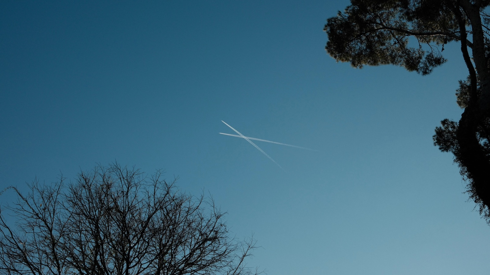

Back to basics, you and me, meeting face to face to talk, relate, be.

No emails, no messages. No screens. Nothing in between. Direct contact. You come as you are, and I come as I am. You see me, and I see you. Maybe we talk, maybe we sustain the silence, maybe we just see each other. You and me, here and now, as we are.

I am thinking of the face. What do you see when you see me? Do you see my eyes, my nose, my mouth? Or do you see my face? When I send a message I see a face frozen in time, a face of the past. I do not see your face as it is now. I am not sure I would have said the same thing to your face.

When I speak to you, do I say things at your face or to your face? Or do I speak to you who is behind the face? Is the face you? What is you, if not the face?

When I see you seeing my face, I am seen. What is face?

When I think about my grandparents, I am nostalgic.

When I think about my parents, I am angry.

When I think about my brother, I am lonely.

When I think about my daughter, I see her face smiling, I feel joy. Sometimes I see her sad face, I feel anxious. Sometimes I see her angry face, I feel her anger and want to share it. What is face?

Every day I see many faces, amazed, happy, suspended, tired, worried.

I see the face as the meeting point. It is where I meet you as you are. I stay. I am looking at your face. A moment of silence. We talk. I see your face change. Your face is different when I ask you about who you love. Your face is alive, either alive with joy or sadness. It depends on which face became visible to you when I asked you about who you love. Is that face still among us, or is it a face of the past?

What does it mean to remember you? I remember your face. I remember its expressions. The presence of you is your face stored in my memory.

I remember many faces, my first teacher, my first mentor, the kind faces of the people who asked me how I am when they saw my scared face.

I remember many faces, my first love, my first heartbreak.

I remember many faces… I see new faces every day.

Will I also remember them?
