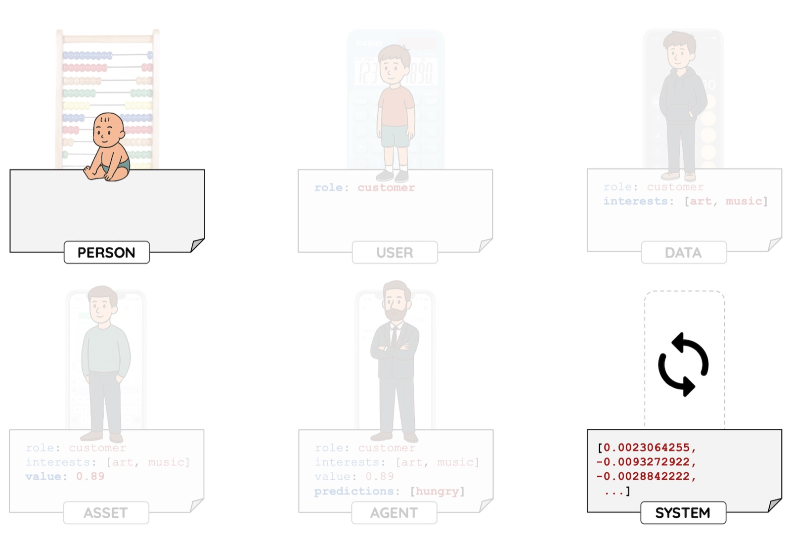

I have been building software for 20 years, through the web, mobile, and cloud shifts. AI feels fundamentally different because it is not just changing how we build things, it is changing what work means. If Martin Heidegger were alive, he might have called it an *enframing* of *enframing*, a point in time when we are moving from *logic that computes* to *data that completes*.

It clicked for me twice. First, during my MSc in Philosophy (2024–2025), which I completed in Spanish despite intermediate language skills. ChatGPT became essential, translating texts, explaining concepts, helping me engage with the material rather than just struggling with language. Then again in November 2025, after two months with Cursor. I realised it is a superpower if you use it as a tool, but a disaster if you let it write everything and become just a reviewer. You lose the critical skill of actually understanding code.

LLMs will probably make traditional office work obsolete within a few years, and society is not adapting quickly enough. Will the middle get compressed, seniors become 10x, and the gap widen?

But this did not start with LLMs. Technology became an extraction machine long before that.

I spent years building systems, leading teams, shipping products. But the problems I kept solving technically were not actually technical problems. They were questions about who controls data, who benefits from automation, what happens when systems scale beyond anyone's understanding. The code was the easy part. The hard part was everything around it.

So I studied philosophy. My thesis argued that data systems do not just record reality, they recursively shape how we see the world, decide, and act. That is not a technical problem. It is a strategic one.

Now I am studying Gestalt therapy. It lets me experience what being shaped by these systems actually does to people.

I know how these systems are built. What I care about now is that they do not build us.
