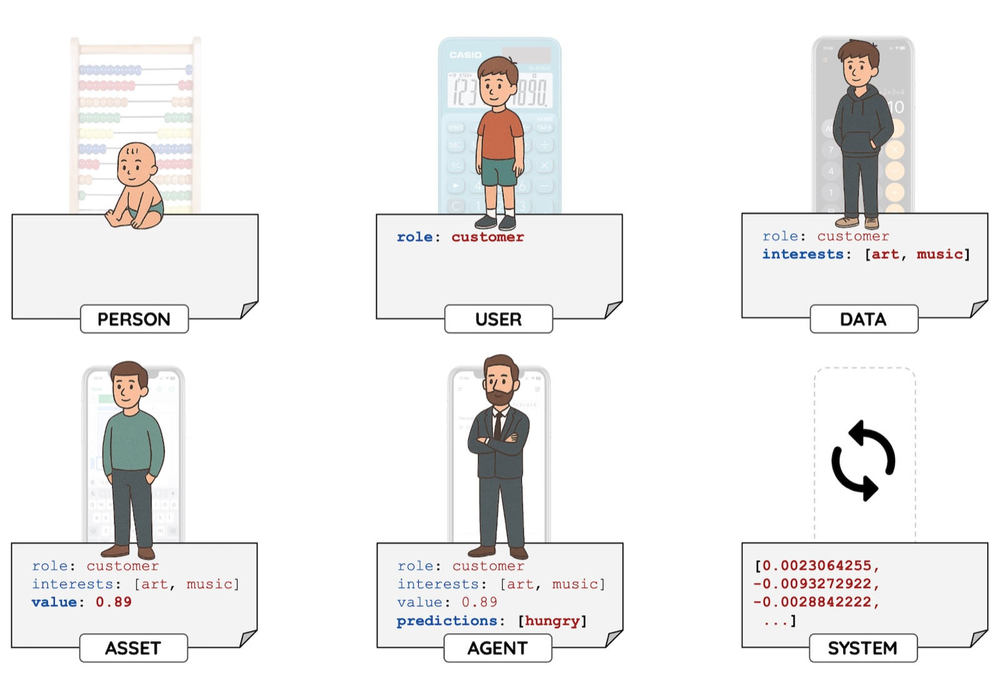
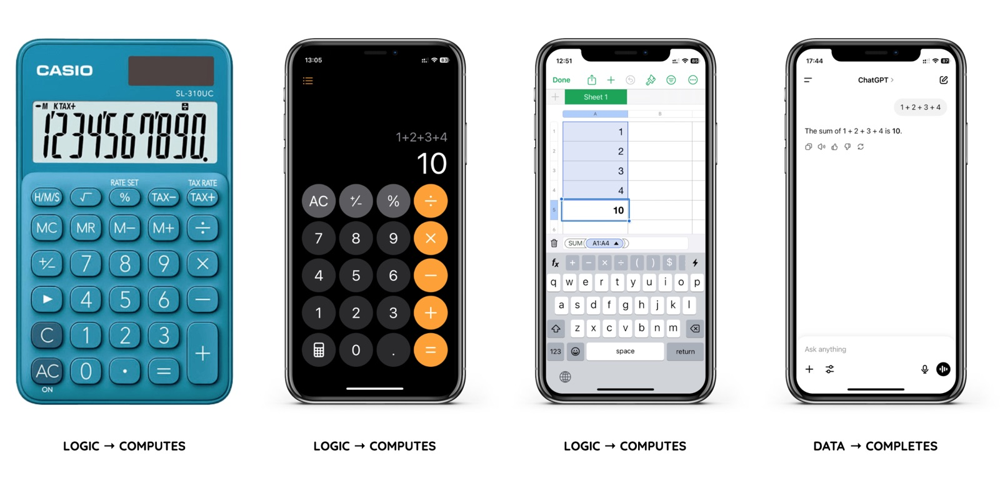
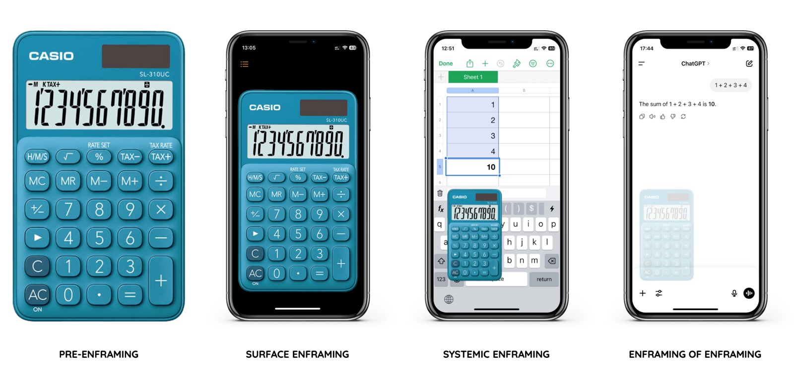
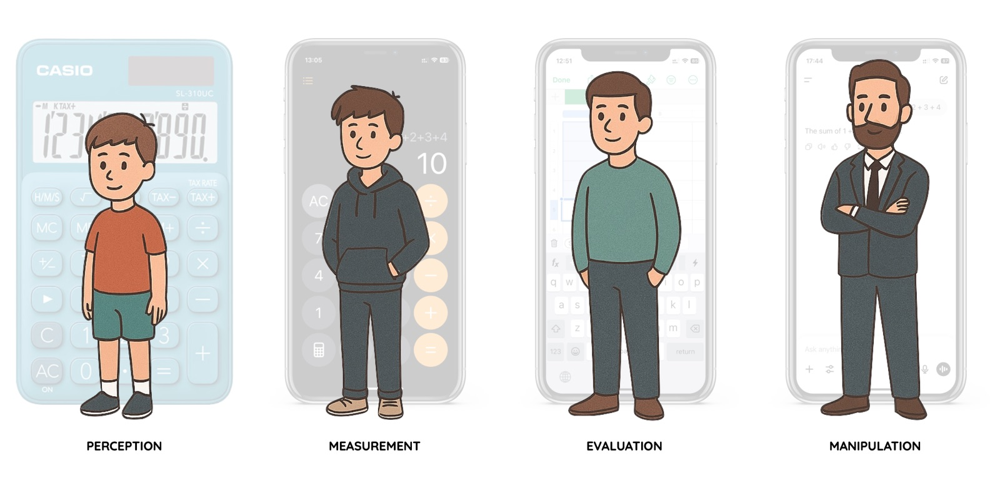
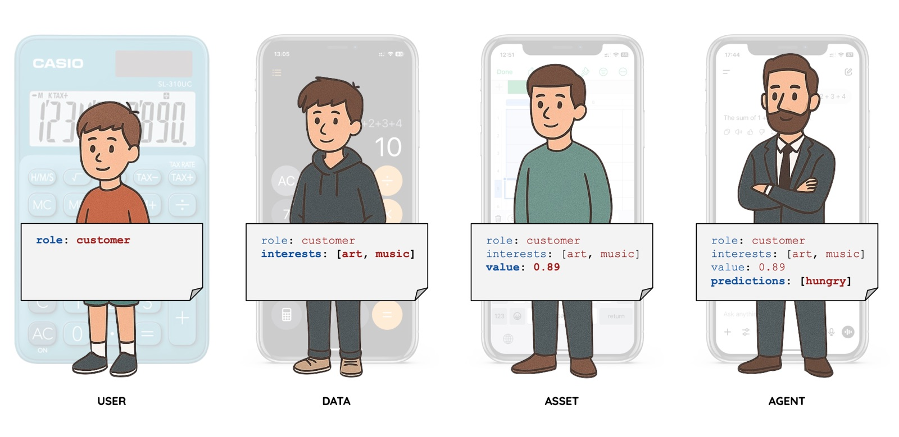
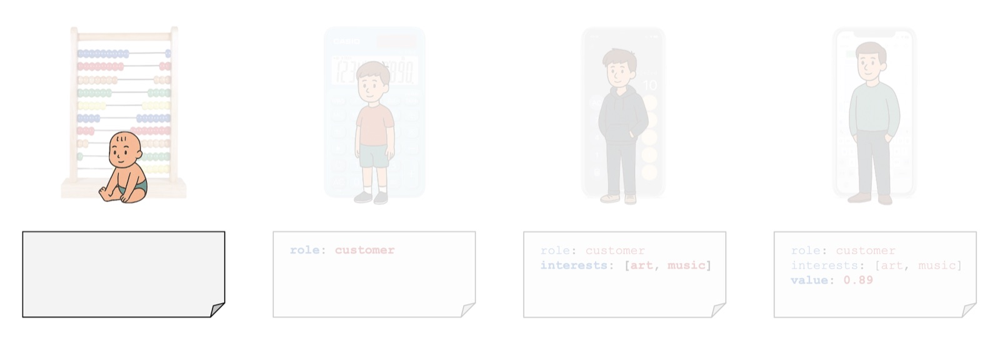
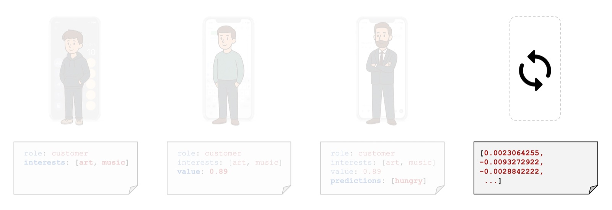

We are at a point in time when agency is shifting from user to system.

Last summer I completed an MSc in Philosophy. My thesis, *Data, Power, and Human Intention*, asked a question that kept deepening the more I worked on it. The formal question was:

*What does the logic of technology reveal about the evolving relationship between data, power, and human intention?*

This text is my attempt to name something that I feel but rarely verbalise, that the systems we build are now building us.

## I. Where is the calculator? Watch it disappear.

Start with something familiar. A calculator.

Four stages of the same function providing seemingly the same result.

What was once a *concrete tool* becomes *system functionality.* The function persists, but our relationship to it transforms completely.

This is the key shift, we move from *logic that computes* to *data that completes*, transferring agency from *user* to *system*. The first three calculators wait for our input and execute our logic. The fourth anticipates what we want and gives us an answer before we have fully formulated the question.

From a *physical* device in our hand to an *invisible* function we never see or touch. The tool disappears, and with it, our awareness that we are using one at all.

Instead of seeing the world directly, we see it through the system's sense of relevance. This is a shift from framing the world to framing the frame.

## II. Compute → Complete. The invisible shift.

Is *enframing* of *enframing* a consequence of how algorithms learned to shape our seeing?

Martin Heidegger saw modern technology as reducing the world to *standing-reserve*. Everything becomes a resource waiting to be optimised. A river becomes a power supply. A forest becomes timber inventory.

But today's infrastructures go further. They do not just frame objects. They frame the act of framing itself.

Feed algorithms determine what we see before we choose. Predictive policing flags individuals before any action. Generative artificial intelligence creates representations of people we have never met, based on patterns we did not choose.

I saw tools that used to wait for us begin to anticipate us. Shaping perception before use even begins. We experience only what the system deems relevant.

## III. The pause is gone. What is lost?

Today, data systems do not just represent reality. They preempt it, conditioning us quietly.

Watch it through a life.

A child is seen and named. A teenager is measured and assessed. A young adult is evaluated. An adult is manipulated. Systems deepen their hold, from observing to shaping. As systems deepen, so does the reduction.

This is where the argument becomes uncomfortable. The trajectory follows a clear logic, *being → objectification → datafication → commodification → intelligence → pattern.*

Data systems are designed to capture us at our most vulnerable and convert that state into profit. Systems identify emotional exposure in users, not to help, but to target.

We move through *person → user → data → asset → agent → system*. A reduction of identity to a function within the infrastructure we built. This is the most hidden stage. Here, data is not only extracted but used to automate decisions, structure environments, and shape perception.

Power today lies in owning the infrastructure, the model, the frame.

The danger is not rogue artificial intelligence. The danger is that we stop asking what we want, outsourcing our desires to predictive systems. When the system knows the next step, we lose the pause where intention forms. Systems give certain certainty. Not knowing is freedom.

## IV. Breath. Home. Presence. The return.

If power lies in owning the frame, what happens to someone who never had a fixed frame to begin with? Displacement was belonging.

Throughout my life, I have crossed borders. Latvia, Ukraine, Russia, Poland, UK, US, Spain. With each move, I adapted to new languages, cultures, and identities. The word *home* became more of an idea than a place.

I see technology as an idea that I decided to call home, the one fixed place where I could belong. A home that became a prison. What does the builder see when he realises what he built?

Presence introduces no system. It is not about fixing but about noticing.

Presence. A return not to ignorance, but to the kind of attention that data systems are structurally designed to prevent.

Attention outside screens.

## V. Empty space. What we are when nothing preempts us.

First, *logic that computes*. Then, *data that completes*. Now, *models that preempt*.

At this point, we are no longer an *objectified* *user*, or even an *intelligent* *agent*. We are a *pattern* within a *system*, a vector of floating-point numbers. The system does not need to understand us. It only needs to predict us.

The system cannot complete an empty space, because there is nothing to predict. Its fear is the void. It needs content, data, signal.

What is there when the system stops?

## VI. This moment.

I was not born into Orwell's dystopian 1984, but into a transitional 1984, setting me on a path of constant change that is still unfolding. Maybe it is simply the human condition to be in a perpetual state of transition. If we accept that, then we might find liberation.

Presence now lives in the ordinary moments of my life.

Home is seeing my daughter in the morning. Home is sharing silence with my wife. Home is walking with a friend. Home is asking someone a real "how are you?". Home is this moment, alive, aware, breathing.
